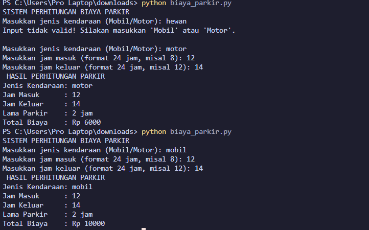

# Studi Kasus 5: Sistem Perhitungan Biaya Parkir

Dokumentasi ini dibuat untuk memenuhi tugas **Praktikum Dasar-Dasar Pemrograman (DDP) 2026** - Studi Kasus 5 untuk kelompok **NIM GENAP**.

---

## 👤 Identitas Praktikan
* **Nama** : M. Fairuz Firerza Aliushami
* **NIM** : 2609116062
* **Kelas** : Sistem Informasi A 2026
* **Tema** : Sistem Perhitungan Biaya Parkir (Function / Fungsi)

---

## 📌 Deskripsi Program
Program ini dibuat dalam bahasa pemrograman **Python** untuk menghitung total biaya parkir kendaraan berdasarkan jenis kendaraan dan lama waktu parkir menggunakan penerapan **Function (Fungsi)**.

### Ketentuan Tarif:
1. **Mobil** : Rp5.000 / jam
2. **Motor** : Rp3.000 / jam

---

## ⚙️ Penjelasan Fungsi dan Komponen Kode

1. **Definisi Function (`def hitung_biaya_parkir(jenis_kendaraan, lama_parkir)`)**:
   * Fungsi dibuat menerima 2 parameter, yaitu `jenis_kendaraan` dan `lama_parkir`.
   * Mengembalikan total biaya berdasarkan perhitungan `tarif * lama_parkir` menggunakan keyword `return`.
2. **Validasi Input Jenis Kendaraan (`while loop`)**:
   * Menggunakan perulangan `while` untuk memastikan pengguna hanya memasukkan opsi **Mobil** atau **Motor**. Jika menginput kata selain itu (misalnya: *hewan*), program akan menampilkan peringatan dan meminta input ulang tanpa *crash*.
3. **Kalkulasi Durasi**:
   * Mengurangi `jam_keluar - jam_masuk` untuk menghitung lama parkir dalam satuan jam.
4. **Pemanggilan Function & Output**:
   * Memanggil fungsi `hitung_biaya_parkir(jenis, durasi)` dan menampilkan ringkasan data kendaraan, jam masuk, jam keluar, lama parkir, serta total biaya parkir.

---

## 🖥️ Contoh Tampilan Output Program

